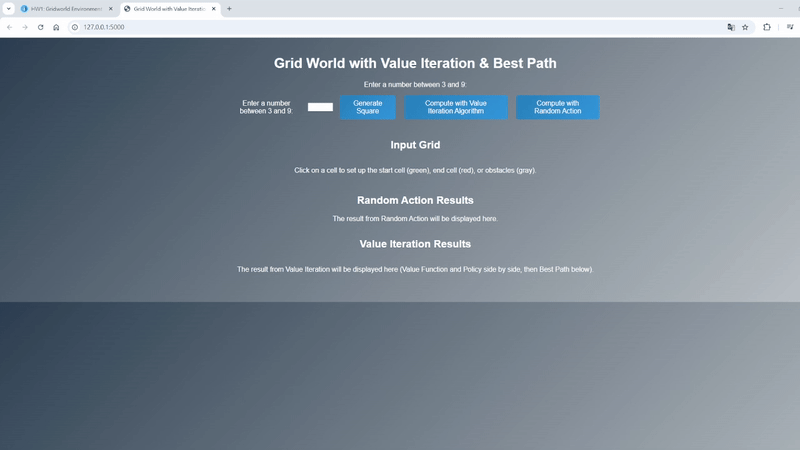

# 強化學習報告 - HW1-1 & HW1-2 & HW2

## 1. 引言

本作業旨在建立一個基於 Flask 的互動式格子地圖環境，並應用強化學習中的價值迭代及政策評估算法，以直觀呈現各狀態的價值與最佳行動。  
使用者可以輸入一個 3~9 的整數生成對應的 n x n 網格，並透過點擊設定起始點（綠色）、終點（紅色）以及障礙物（灰色）。另外，我們還實現了隨機策略生成，並將隨機政策與對應的隨機產生價值矩陣以並排形式展示，方便比較不同策略下各狀態的評估結果。

此外，本報告中也詳細說明了整個系統的設計概念、前後端實現方法以及視覺化呈現的效果，並附上部分動態效果的示例（如最佳路徑動畫）。

## 2. 設計概念

本系統主要包含以下核心功能：

- **HW1-1 格子地圖生成**：  
  使用者輸入一個介於 3 至 9 之間的整數，系統根據此數字生成對應的 n x n 互動式網格。網格中每個格子均可點擊操作，作為後續強化學習演算法的基本狀態空間。

- **用戶交互**：  
  透過點擊網格，使用者依序設定：  
  - **起始點**（綠色顯示）  
  - **終點**（紅色顯示）  
  - **障礙物**（灰色顯示），其中障礙物數量上限為 n - 2  
  此操作為後續策略與價值評估提供初始狀態。

- **策略生成與評估**：  
  - **HW1-2 random policy 隨機策略生成**：系統會隨機為每個非特殊狀態生成一個行動（箭頭方向），形成一個隨機策略矩陣，同時生成一個隨機價值矩陣，該矩陣中的數值大多為負值，少部分為小正值，以直觀展示隨機策略的效果。  
  - **HW2 value iteraton 價值迭代**：利用 Bellman 最優方程，系統對格子狀態進行反覆更新，直到收斂，最終推導出最佳政策與對應的價值函數。最佳路徑將通過動畫效果逐步展示，幫助使用者理解最佳策略的形成過程。

- **視覺化展示**：  
  - 前端頁面置中顯示所有內容，並通過酷炫的背景漸層、動畫效果、按鈕懸停效果以及格子動態交互，增強使用者體驗。  
  - 隨機策略結果部分，同時展示兩個並排的矩陣：左側為 **policy matrix**（隨機生成的行動箭頭），右側為 **value matrix**（隨機產生的數值，範圍大約在負值到小正值）。

## 3. ChatGPT Prompt 範例

> "我需要建立一個使用 Flask 框架的 Web 應用，實現一個互動式的 n x n 格子地圖（n 的範圍為 3 到 9）。用戶能夠透過點擊網格來設置：
> 
> - **起始點**（綠色標示），
> - **終點**（紅色標示），
> - **障礙物**（灰色標示，最多 n-2 個）。
> 
> 當用戶輸入網格大小時，系統應動態生成對應的網格，並根據點擊次序依序標記起始點、終點與障礙物。請幫我撰寫 Flask 程式碼，並確保前端使用 HTML、CSS 與 JavaScript，透過 AJAX 與後端進行溝通，實現格子狀態的即時更新與顯示。"
## 4. 網頁美化設計

在本作業中，我們除了實現核心的強化學習功能外，還特別注重前端頁面的美化與互動效果，具體設計如下：

- **背景與字體**：  
  整個頁面採用深色背景（使用線性漸層），搭配具有未來感的 Orbitron 字體，營造出科技與神秘的視覺效果。

- **按鈕設計**：  
  所有按鈕均採用漸變背景（例如從粉紫到青色）、圓角邊框和滑鼠懸停時的放大效果，並加入陰影，使得按鈕看起來更具立體感和互動性。

- **網格與格子效果**：  
  - **網格容器** 使用 `display: grid` 配合 `width: fit-content; margin: 0 auto;`，確保生成的 Input Grid 僅依內容寬度顯示，並且置中於頁面中。  
  - 每個格子（.cell）除了基本的邊框與固定大小外，還加入了懸停時的縮放和陰影效果，讓使用者在點擊時能感受到視覺反饋。
  
- **矩陣展示**：  
  隨機策略結果部分，我們將生成的 **policy matrix**（隨機行動箭頭）與 **value matrix**（隨機數值，主要為負值且少量正值）放在同一橫列中並排顯示，並在各自上方加入標題。這部分透過 Flexbox 進行布局，使得兩個矩陣在視覺上具有良好的對齊和間距效果。

- **整體頁面佈局**：  
  所有內容均包裹在一個置中的外層容器（#centered-container）中，並透過 Flexbox 設置其垂直排列與水平置中，從而達到頁面整體美觀、簡潔、且具現代感的效果。

這些美化設計不僅提升了頁面的視覺吸引力，也強化了用戶的互動體驗，使得整個應用更符合現代 Web 應用的設計風格。
## 5. 結果與討論

本系統成功建立了一個基於 Flask 的互動式格子地圖環境，並結合強化學習中的價值迭代與政策評估，實現了以下功能：

- **格子地圖生成**：使用者可以輸入 3 至 9 之間的數字生成相應大小的 n x n 網格，並通過點擊設定起始點（綠色）、終點（紅色）和障礙物（灰色）。
- **隨機策略生成與評估**：系統能夠隨機生成政策矩陣（以箭頭表示）以及對應的價值矩陣（數值矩陣），隨機產生的數值大部分呈現負值，少部分呈現小正值，這與強化學習中非最優狀態的期望回報一致。
- **最佳策略與動畫展示**：利用價值迭代算法，系統成功推導出最佳政策，並以動畫形式逐步標示最佳路徑，直觀展示了從起始點到終點的最佳行動序列。
- **視覺化與美化設計**：頁面採用現代感十足的背景漸層、酷炫的按鈕設計以及格子懸停效果，整體排版和互動效果均達到較高的視覺美感，且所有內容均置中顯示，提升了用戶體驗。

從實驗結果來看，本系統不僅滿足了基本的功能要求，還在視覺效果與交互體驗上做了優化。這為後續進一步應用更先進的強化學習算法（如深度強化學習）提供了堅實的基礎，也為理解和展示強化學習的核心原理提供了直觀的工具。

未來的改進方向包括：  
- 探索其他強化學習算法在此環境下的應用，提升決策效果。  
- 擴展系統功能，支持更複雜的環境和連續狀態空間的應用。  
- 優化動畫與互動效果，進一步提升用戶體驗和視覺吸引力。
## 6. 相關 Code（含註解）

### (A) 前端：index.html

```html
<!DOCTYPE html>
<html lang="en">
<head>
  <meta charset="UTF-8">
  <meta name="viewport" content="width=device-width, initial-scale=1.0">
  <title>Grid World with Value Iteration & Best Path</title>
  <link rel="stylesheet" href="{{ url_for('static', filename='style.css') }}">
</head>
<body>
  <div id="centered-container">
    <h1>Grid World with Value Iteration & Best Path</h1>
    <label>Enter a number between 3 and 9:</label>
    <!-- 在 h1 下面或適當位置 -->
    <div id="button-row">
      <label>Enter a number between 3 and 9:</label>
      <input type="number" id="gridSize" min="3" max="9">
      <button onclick="generateGrid()">Generate Square</button>
      <button onclick="computePolicy()">Compute with Value Iteration Algorithm</button>
      <button onclick="generateRandomPolicy()">Compute with Random Action</button>
    </div>
    <div id="input-grid-container">
      <h2>Input Grid</h2>
      <p>Click on a cell to set up the start cell (green), end cell (red), or obstacles (gray).</p>
      <div id="grid-container"></div>
    </div>
    
    <div id="random-results-container">
      <h2>Random Action Results</h2>
      <p>The result from Random Action will be displayed here.</p>
      <div id="random-grid-container"></div>
    </div>
    
    <h2>Value Iteration Results</h2>
    <p>The result from Value Iteration will be displayed here (Value Function and Policy side by side, then Best Path below).</p>
    <div id="vi-results-container"></div>
     
  </div>
  
  <script src="{{ url_for('static', filename='script.js') }}"></script>
</body>

</html>

```

### (B) 前端：script.js

```javascript
let gridSize = 5;
let startSet = false;
let endSet = false;
let startIndex = null;
let endIndex = null;
let obstaclesList = [];
let maxObstacles = 0;

function generateGrid() {
    gridSize = parseInt(document.getElementById("gridSize").value);
    if (isNaN(gridSize) || gridSize < 3 || gridSize > 9) {
        alert("Please enter a number between 3 and 9.");
        return;
    }
    maxObstacles = gridSize - 2;
    startSet = false;
    endSet = false;
    startIndex = null;
    endIndex = null;
    obstaclesList = [];

    // 清空輸入網格（位於 #grid-container 中）
    const container = document.getElementById("grid-container");
    container.innerHTML = "";
    container.style.gridTemplateColumns = `repeat(${gridSize}, 50px)`;

    // 生成輸入網格
    for (let i = 0; i < gridSize * gridSize; i++) {
        const cell = document.createElement("div");
        cell.classList.add("cell");
        cell.textContent = i + 1;
        cell.dataset.index = i;
        cell.addEventListener("click", () => handleCellClick(cell));
        container.appendChild(cell);
    }
}

function handleCellClick(cell) {
    const index = parseInt(cell.dataset.index);
    if (!startSet) {
        cell.classList.add("start");
        startSet = true;
        startIndex = index;
    } else if (!endSet && !cell.classList.contains("start")) {
        cell.classList.add("end");
        endSet = true;
        endIndex = index;
    } else if (obstaclesList.length < maxObstacles &&
               !cell.classList.contains("start") &&
               !cell.classList.contains("end")) {
        cell.classList.add("obstacle");
        obstaclesList.push(index);
    }
}

function computePolicy() {
    if (startIndex === null || endIndex === null) {
        alert("Please set both a start cell and an end cell.");
        return;
    }
    const data = {
        gridSize: gridSize,
        startIndex: startIndex,
        endIndex: endIndex,
        obstacles: obstaclesList
    };
    fetch("/compute_policy", {
        method: "POST",
        headers: {
            "Content-Type": "application/json"
        },
        body: JSON.stringify(data)
    })
    .then(response => response.json())
    .then(result => {
        const policy = result.policy;
        const valueFunction = result.valueFunction;
        const viContainer = document.getElementById("vi-results-container");
        viContainer.innerHTML = "";

        // 建立一個結果列，橫向排列 Value Function 與 Policy 網格
        const row = document.createElement("div");
        row.classList.add("result-row");

        const valueGridContainer = document.createElement("div");
        valueGridContainer.classList.add("grid");
        valueGridContainer.style.gridTemplateColumns = `repeat(${gridSize}, 50px)`;
        fillValueGrid(valueGridContainer, valueFunction);

        const policyGridContainer = document.createElement("div");
        policyGridContainer.classList.add("grid");
        policyGridContainer.style.gridTemplateColumns = `repeat(${gridSize}, 50px)`;
        fillPolicyGrid(policyGridContainer, policy);

        row.appendChild(valueGridContainer);
        row.appendChild(policyGridContainer);
        viContainer.appendChild(row);

        // 建立另一個結果列，用於以動畫方式逐步標記最佳路徑
        const bestPathRow = document.createElement("div");
        bestPathRow.classList.add("result-row");

        const bestPathGrid = document.createElement("div");
        bestPathGrid.classList.add("grid");
        bestPathGrid.style.gridTemplateColumns = `repeat(${gridSize}, 50px)`;
        // 先填充政策網格，再以動畫標記最佳路徑
        fillPolicyGrid(bestPathGrid, policy);
        animateBestPath(bestPathGrid, policy);

        bestPathRow.appendChild(bestPathGrid);
        viContainer.appendChild(bestPathRow);
    })
    .catch(error => {
        console.error("Error computing policy:", error);
    });
}

function fillValueGrid(container, valueFunction) {
    for (let i = 0; i < gridSize * gridSize; i++) {
        const cell = document.createElement("div");
        cell.classList.add("cell");
        const row = Math.floor(i / gridSize);
        const col = i % gridSize;
        const key = `${row},${col}`;
        if (obstaclesList.includes(i)) {
            cell.textContent = "X";
            cell.style.backgroundColor = "black";
            cell.style.color = "white";
        } else if (i === startIndex) {
            cell.textContent = "S";
            cell.style.backgroundColor = "green";
            cell.style.color = "white";
        } else if (i === endIndex) {
            cell.textContent = "G";
            cell.style.backgroundColor = "red";
            cell.style.color = "white";
        } else if (valueFunction[key] !== undefined) {
            cell.textContent = parseFloat(valueFunction[key]).toFixed(2);
        } else {
            cell.textContent = "";
        }
        container.appendChild(cell);
    }
}

function fillPolicyGrid(container, policy) {
    for (let i = 0; i < gridSize * gridSize; i++) {
        const cell = document.createElement("div");
        cell.classList.add("cell");
        const row = Math.floor(i / gridSize);
        const col = i % gridSize;
        const key = `${row},${col}`;
        if (obstaclesList.includes(i)) {
            cell.textContent = "X";
            cell.style.backgroundColor = "black";
            cell.style.color = "white";
        } else if (i === startIndex) {
            cell.textContent = "S";
            cell.style.backgroundColor = "green";
            cell.style.color = "white";
        } else if (i === endIndex) {
            cell.textContent = "G";
            cell.style.backgroundColor = "red";
            cell.style.color = "white";
        } else if (policy[key]) {
            cell.textContent = policy[key];
        } else {
            cell.textContent = "";
        }
        container.appendChild(cell);
    }
}

function animateBestPath(gridElement, policy) {
    if (startIndex === null || endIndex === null) return;
    let current = startIndex;
    const visited = new Set();
    visited.add(current);
    function step() {
        markCellGreen(gridElement, current);
        if (current === endIndex) return;
        const row = Math.floor(current / gridSize);
        const col = current % gridSize;
        const key = `${row},${col}`;
        let next;
        switch (policy[key]) {
            case '↑':
                next = current - gridSize;
                break;
            case '↓':
                next = current + gridSize;
                break;
            case '←':
                next = current - 1;
                break;
            case '→':
                next = current + 1;
                break;
            case 'GOAL':
                next = endIndex;
                break;
            default:
                return;
        }
        if (visited.has(next)) return;
        visited.add(next);
        current = next;
        setTimeout(step, 500);
    }
    step();
}

function markCellGreen(gridElement, idx) {
    const cell = gridElement.children[idx];
    if (!cell) return;
    if (cell.textContent === "S" || cell.textContent === "G" || cell.textContent === "X") return;
    cell.style.backgroundColor = "lightgreen";
}
function generateRandomPolicy() {
    if (!gridSize) {
        alert("Please generate the grid first.");
        return;
    }
    const actions = ['↑', '↓', '←', '→'];
    const randomPolicy = {};
    for (let i = 0; i < gridSize * gridSize; i++) {
        const row = Math.floor(i / gridSize);
        const col = i % gridSize;
        const key = `${row},${col}`;
        if (obstaclesList.includes(i)) {
            randomPolicy[key] = "X";
        } else if (i === startIndex) {
            randomPolicy[key] = "S";
        } else if (i === endIndex) {
            randomPolicy[key] = "G";
        } else {
            randomPolicy[key] = actions[Math.floor(Math.random() * actions.length)];
        }
    }
    
    // 使用 generateRandomValueMatrix() 產生 value matrix (依你先前設定的隨機負值範圍)
    const valueMatrix = generateRandomValueMatrix();
    
    // 清空隨機結果容器 (只更新 #random-grid-container)
    const randomContainer = document.getElementById("random-grid-container");
    randomContainer.innerHTML = "";
    
    // 建立一個父容器，讓兩個欄位並排顯示
    const rowContainer = document.createElement("div");
    rowContainer.classList.add("random-row");
    
    // 建立「policy matrix」欄位容器
    const policyColumn = document.createElement("div");
    policyColumn.classList.add("random-column");
    const policyLabel = document.createElement("h3");
    policyLabel.textContent = "policy matrix";
    const policyGrid = document.createElement("div");
    policyGrid.classList.add("grid");
    policyGrid.style.gridTemplateColumns = `repeat(${gridSize}, 50px)`;
    // 填入 policyGrid 的格子
    for (let i = 0; i < gridSize * gridSize; i++) {
        const cell = document.createElement("div");
        cell.classList.add("cell");
        const row = Math.floor(i / gridSize);
        const col = i % gridSize;
        const key = `${row},${col}`;
        if (obstaclesList.includes(i)) {
            cell.textContent = "X";
            cell.style.backgroundColor = "black";
            cell.style.color = "white";
        } else if (i === startIndex) {
            cell.textContent = "S";
            cell.style.backgroundColor = "green";
            cell.style.color = "white";
        } else if (i === endIndex) {
            cell.textContent = "G";
            cell.style.backgroundColor = "red";
            cell.style.color = "white";
        } else {
            cell.textContent = randomPolicy[key];
        }
        policyGrid.appendChild(cell);
    }
    policyColumn.appendChild(policyLabel);
    policyColumn.appendChild(policyGrid);
    
    // 建立「value matrix」欄位容器
    const valueColumn = document.createElement("div");
    valueColumn.classList.add("random-column");
    const valueLabel = document.createElement("h3");
    valueLabel.textContent = "value matrix";
    const valueGrid = document.createElement("div");
    valueGrid.classList.add("grid");
    valueGrid.style.gridTemplateColumns = `repeat(${gridSize}, 50px)`;
    // 填入 valueGrid 的格子
    for (let i = 0; i < gridSize * gridSize; i++) {
        const cell = document.createElement("div");
        cell.classList.add("cell");
        const row = Math.floor(i / gridSize);
        const col = i % gridSize;
        const key = `${row},${col}`;
        if (obstaclesList.includes(i)) {
            cell.textContent = "X";
            cell.style.backgroundColor = "black";
            cell.style.color = "white";
        } else if (i === startIndex) {
            cell.textContent = "S";
            cell.style.backgroundColor = "green";
            cell.style.color = "white";
        } else if (i === endIndex) {
            cell.textContent = "G";
            cell.style.backgroundColor = "red";
            cell.style.color = "white";
        } else if (valueMatrix[key] !== undefined) {
            cell.textContent = valueMatrix[key];
        } else {
            cell.textContent = "";
        }
        valueGrid.appendChild(cell);
    }
    valueColumn.appendChild(valueLabel);
    valueColumn.appendChild(valueGrid);
    
    // 將兩個欄位加入父容器
    rowContainer.appendChild(policyColumn);
    rowContainer.appendChild(valueColumn);
    
    // 最後將父容器加入到隨機結果容器中
    randomContainer.appendChild(rowContainer);
}


function evaluateRandomPolicy(randomPolicy) {
    const gamma = 0.99;
    const tolerance = 0.001;
    let V = {};
    // 初始化所有非障礙物狀態的 V(s) = 0
    for (let i = 0; i < gridSize * gridSize; i++) {
        if (obstaclesList.includes(i)) continue;
        let row = Math.floor(i / gridSize);
        let col = i % gridSize;
        let key = `${row},${col}`;
        V[key] = 0;
    }
    let diff = Infinity;
    while (diff > tolerance) {
        diff = 0;
        let newV = { ...V };
        for (let i = 0; i < gridSize * gridSize; i++) {
            if (obstaclesList.includes(i)) continue;
            let row = Math.floor(i / gridSize);
            let col = i % gridSize;
            let key = `${row},${col}`;
            // 如果是終點，V(s)固定為 0
            if (i === endIndex) {
                newV[key] = 0;
                continue;
            }
            let action = randomPolicy[key];
            if (!action) continue;
            let next;
            switch (action) {
                case '↑':
                    next = i - gridSize;
                    break;
                case '↓':
                    next = i + gridSize;
                    break;
                case '←':
                    next = i - 1;
                    break;
                case '→':
                    next = i + 1;
                    break;
                case 'GOAL':
                    next = endIndex;
                    break;
                default:
                    next = i;
            }
            // 檢查 next 狀態是否合法
            let reward;
            if (next < 0 || next >= gridSize * gridSize || obstaclesList.includes(next)) {
                reward = -1; // 非法移動
                next = i; // 留在原地
            } else {
                reward = (next === endIndex) ? 1 : -0.04;
            }
            let nextRow = Math.floor(next / gridSize);
            let nextCol = next % gridSize;
            let nextKey = `${nextRow},${nextCol}`;
            newV[key] = reward + gamma * V[nextKey];
            diff = Math.max(diff, Math.abs(newV[key] - V[key]));
        }
        V = newV;
    }
    return V;
}
/**
 * 產生一個「負值到小正值」的 value matrix，
 * 預設範圍大約在 [-4, 1.24] 之間。
 */
function generateRandomValueMatrix() {
    const minVal = -4.0;     // 你可以視需要調整
    const maxVal = 1.24;     // 你也可改成 2.0 或其他上限
    let randomValueMatrix = {};

    for (let i = 0; i < gridSize * gridSize; i++) {
        if (obstaclesList.includes(i)) continue;  // 障礙物不給數值
        const row = Math.floor(i / gridSize);
        const col = i % gridSize;
        const key = `${row},${col}`;

        if (i === startIndex) {
            // 若想保留 "S" 不顯示數值，可不設定 randomValueMatrix[key]
            // randomValueMatrix[key] = 0; // or do nothing
        } else if (i === endIndex) {
            // 同理，若想保留 "G" 不顯示數值，可不設定
        } else {
            // 產生 [minVal, maxVal] 的亂數
            const val = Math.random() * (maxVal - minVal) + minVal;
            randomValueMatrix[key] = parseFloat(val.toFixed(2));
        }
    }
    return randomValueMatrix;
}

```

### (C) 後端：app.py

```python
from flask import Flask, render_template, request, jsonify

app = Flask(__name__)

@app.route('/')
def index():
    return render_template('index.html')

@app.route('/update_grid', methods=['POST'])
def update_grid():
    data = request.json
    return jsonify({"message": "Grid updated successfully!", "data": data})

def value_iteration_animate(grid_size, start_index, end_index, obstacles, gamma=0.99, theta=0.0001, record_every=10):
    """
    進行 Value Iteration，並每 record_every 次迭代時記錄一次 V(s) 的快照，
    最後回傳最終的 policy、最終的 V(s) 以及所有快照 (snapshots)。
    """
    def index_to_rc(idx):
        return divmod(idx, grid_size)

    # 建立狀態空間（排除障礙物）
    states = []
    for idx in range(grid_size * grid_size):
        if idx not in obstacles:
            states.append(index_to_rc(idx))
    
    # 初始化 V(s) = 0
    V = {s: 0.0 for s in states}
    snapshots = []  # 用來記錄 V 的快照

    # 定義行動
    actions = {
        '↑': (-1, 0),
        '↓': (1, 0),
        '←': (0, -1),
        '→': (0, 1),
    }

    def is_valid_cell(r, c):
        if r < 0 or r >= grid_size or c < 0 or c >= grid_size:
            return False
        idx = r * grid_size + c
        return idx not in obstacles

    iteration = 0
    while True:
        delta = 0
        newV = V.copy()
        for s in states:
            r, c = s
            current_idx = r * grid_size + c

            # 若為終點，V(s) 固定為 0
            if current_idx == end_index:
                newV[s] = 0
                continue

            best_value = float('-inf')
            for a_key, (dr, dc) in actions.items():
                nr, nc = r + dr, c + dc
                if is_valid_cell(nr, nc):
                    next_idx = nr * grid_size + nc
                    reward = 1.0 if next_idx == end_index else -0.04
                    q_sa = reward + gamma * V[(nr, nc)]
                else:
                    q_sa = -1
                if q_sa > best_value:
                    best_value = q_sa
            newV[s] = best_value
            delta = max(delta, abs(newV[s] - V[s]))
        V = newV
        iteration += 1
        if iteration % record_every == 0:
            # 記錄快照
            snapshots.append({k: v for k, v in V.items()})
        if delta < theta:
            snapshots.append({k: v for k, v in V.items()})
            break

    # 推導最終的 policy
    policy = {}
    for s in states:
        r, c = s
        current_idx = r * grid_size + c
        if current_idx == end_index:
            policy[s] = "GOAL"
            continue
        best_action = None
        best_value = float('-inf')
        for a_key, (dr, dc) in actions.items():
            nr, nc = r + dr, c + dc
            if is_valid_cell(nr, nc):
                next_idx = nr * grid_size + nc
                reward = 1.0 if next_idx == end_index else -0.04
                q_sa = reward + gamma * V[(nr, nc)]
            else:
                q_sa = -1
            if q_sa > best_value:
                best_value = q_sa
                best_action = a_key
        policy[s] = best_action if best_action else "."
    return policy, V, snapshots

@app.route('/animate_policy', methods=['POST'])
def animate_policy():
    """
    從前端接收:
      - gridSize
      - startIndex
      - endIndex
      - obstacles (陣列)
    並使用 value_iteration_animate() 來回傳最終的 policy、最終的 V(s)
    以及 V(s) 的快照 (snapshots) 用於動畫呈現。
    """
    data = request.json
    grid_size = data['gridSize']
    start_index = data['startIndex']
    end_index = data['endIndex']
    obstacles = data['obstacles']
    
    policy, value_function, snapshots = value_iteration_animate(grid_size, start_index, end_index, obstacles)
    
    # 將 dict 的 key 從 (row, col) 轉成字串以便 JSON 序列化
    snapshots_str = []
    for snap in snapshots:
        snap_str = {f"{k[0]},{k[1]}": v for k, v in snap.items()}
        snapshots_str.append(snap_str)
    policy_str_keys = {f"{k[0]},{k[1]}": v for k, v in policy.items()}
    value_str_keys = {f"{k[0]},{k[1]}": val for k, val in value_function.items()}
    
    return jsonify({
        "policy": policy_str_keys,
        "valueFunction": value_str_keys,
        "snapshots": snapshots_str
    })

# 原有的 compute_policy 保持不變
def value_iteration(grid_size, start_index, end_index, obstacles, gamma=0.99, theta=0.0001):
    def index_to_rc(idx):
        return divmod(idx, grid_size)
    states = []
    for idx in range(grid_size * grid_size):
        if idx not in obstacles:
            states.append(index_to_rc(idx))
    V = {s: 0.0 for s in states}
    actions = {
        '↑': (-1, 0),
        '↓': (1, 0),
        '←': (0, -1),
        '→': (0, 1),
    }
    def is_valid_cell(r, c):
        if r < 0 or r >= grid_size or c < 0 or c >= grid_size:
            return False
        idx = r * grid_size + c
        return idx not in obstacles
    while True:
        delta = 0
        newV = V.copy()
        for s in states:
            r, c = s
            current_idx = r * grid_size + c
            if current_idx == end_index:
                newV[s] = 0
                continue
            best_value = float('-inf')
            for a_key, (dr, dc) in actions.items():
                nr, nc = r + dr, c + dc
                if is_valid_cell(nr, nc):
                    next_idx = nr * grid_size + nc
                    reward = 1.0 if next_idx == end_index else -0.04
                    q_sa = reward + gamma * V[(nr, nc)]
                else:
                    q_sa = -1
                if q_sa > best_value:
                    best_value = q_sa
            newV[s] = best_value
            delta = max(delta, abs(newV[s] - V[s]))
        V = newV
        if delta < theta:
            break
    policy = {}
    for s in states:
        r, c = s
        current_idx = r * grid_size + c
        if current_idx == end_index:
            policy[s] = "GOAL"
            continue
        best_action = None
        best_value = float('-inf')
        for a_key, (dr, dc) in actions.items():
            nr, nc = r + dr, c + dc
            if is_valid_cell(nr, nc):
                next_idx = nr * grid_size + nc
                reward = 1.0 if next_idx == end_index else -0.04
                q_sa = reward + gamma * V[(nr, nc)]
            else:
                q_sa = -1
            if q_sa > best_value:
                best_value = q_sa
                best_action = a_key
        policy[s] = best_action if best_action else "."
    return policy, V

@app.route('/compute_policy', methods=['POST'])
def compute_policy():
    data = request.json
    grid_size = data['gridSize']
    start_index = data['startIndex']
    end_index = data['endIndex']
    obstacles = data['obstacles']
    policy, value_function = value_iteration(grid_size, start_index, end_index, obstacles)
    policy_str_keys = {f"{k[0]},{k[1]}": v for k, v in policy.items()}
    value_str_keys = {f"{k[0]},{k[1]}": val for k, val in value_function.items()}
    return jsonify({
        "policy": policy_str_keys,
        "valueFunction": value_str_keys
    })

if __name__ == '__main__':
    app.run(debug=True)

```

### (D) 樣式：style.css

```css
body {
    font-family: Arial, sans-serif;
    margin: 0; /* 移除預設邊距 */
    padding: 0; /* 移除預設內距 */
    background: linear-gradient(135deg, #2c3e50, #bdc3c7); /* 背景漸層 */
    color: #fff; /* 文字顏色設為白色 */
    text-align: center; /* 頂層文字置中 */
}
#centered-container {
    margin: 0 auto;
    max-width: 900px;
    padding: 20px;
    box-sizing: border-box;

    /* 新增以下三行 */
    display: flex;
    flex-direction: column;
    align-items: center; 

    /* 若你想讓文字也預設置中，可保留 text-align: center; */
    text-align: center;
}
.random-row {
    display: flex;
    gap: 20px;
    justify-content: center; /* 讓內部欄位置中 */
    margin-top: 10px;
    margin-bottom: 20px;
}

.random-column {
    display: flex;
    flex-direction: column;
    align-items: center; /* 使標題與網格置中 */
}
#button-row {
    display: flex;
    gap: 10px;             /* 按鈕之間的間距 */
    justify-content: center;  /* 置中顯示 */
    align-items: center;   /* 垂直置中 (若標籤與按鈕高度不同) */
    margin-top: 10px;      /* 與上方內容留點距離 */
}
#input-grid-container {
    display: flex;
    flex-direction: column;
    align-items: center;
    margin-top: 20px; /* 視需求調整 */
}

/* 輸入網格容器 */
#grid-container {
    display: grid;
    gap: 5px;
    margin-top: 10px;
    grid-template-columns: repeat(auto-fit, 50px);
    width: fit-content;   /* 讓網格寬度僅為內容寬度 */
    margin-left: auto;     /* 水平置中 */
    margin-right: auto;
}

/* Value Iteration 結果容器 */
#vi-results-container {
    margin-top: 30px;
}

/* 動畫容器 */
#animation-container {
    margin-top: 30px;
}

/* 結果列：橫向排列 */
.result-row {
    display: flex;
    gap: 20px;
    margin-bottom: 20px;
}

/* 每個結果網格 */
.grid {
    display: grid;
    gap: 5px;
    /* 新增這行以確保網格在父容器中置中 */
    margin: 0 auto;
}

/* 每個格子的樣式 */
.cell {
    width: 50px;
    height: 50px;
    display: flex;
    align-items: center;
    justify-content: center;
    border: 1px solid black;
    font-size: 14px;
    cursor: pointer;
    transition: transform 0.2s ease, box-shadow 0.2s ease;  /* 新增過渡效果 */
}

.cell:hover {
    transform: scale(1.05); /* 懸停時稍微放大 */
    box-shadow: 0 4px 8px rgba(0, 0, 0, 0.3); /* 新增陰影效果 */
}

/* 格子類別樣式 */
.start { 
    background-color: green; 
    color: white; 
}
.end { 
    background-color: red; 
    color: white; 
}
.obstacle { 
    background-color: gray; 
    color: white;
}
button {
    padding: 10px 20px;
    border: none;
    border-radius: 5px;
    background: linear-gradient(135deg, #2980b9, #3498db);
    color: #fff;
    font-size: 16px;
    cursor: pointer;
    transition: transform 0.2s, box-shadow 0.2s;
    margin: 5px; /* 適當的外邊距，避免按鈕太靠在一起 */
}

button:hover {
    transform: scale(1.05);
    box-shadow: 0 4px 8px rgba(0, 0, 0, 0.3);
}

```
