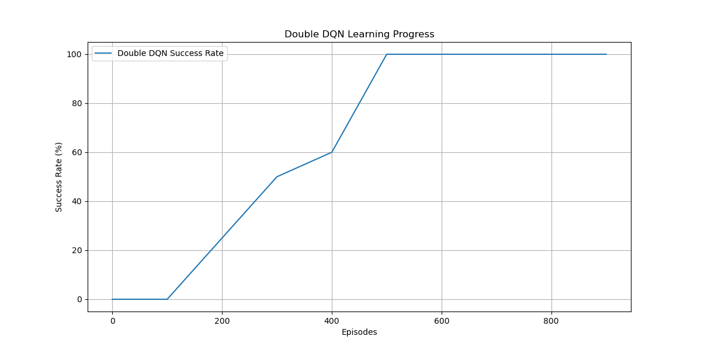
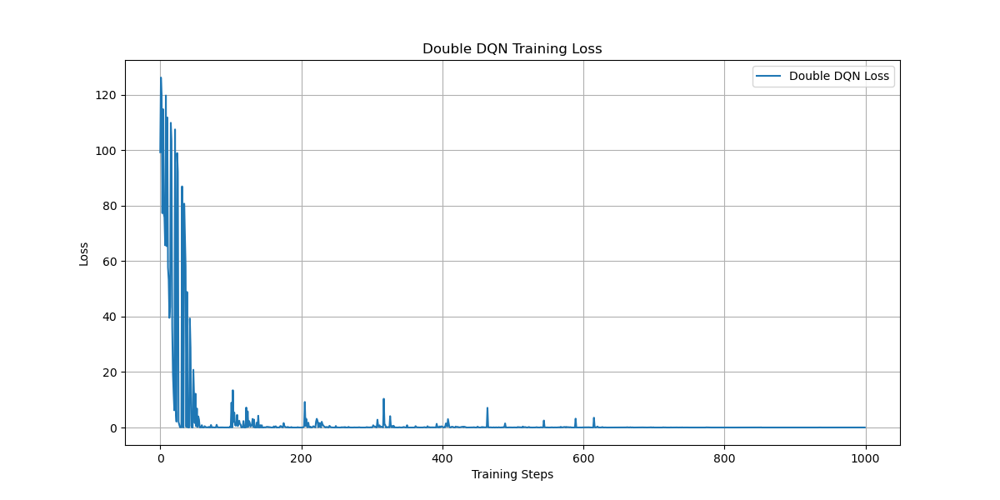
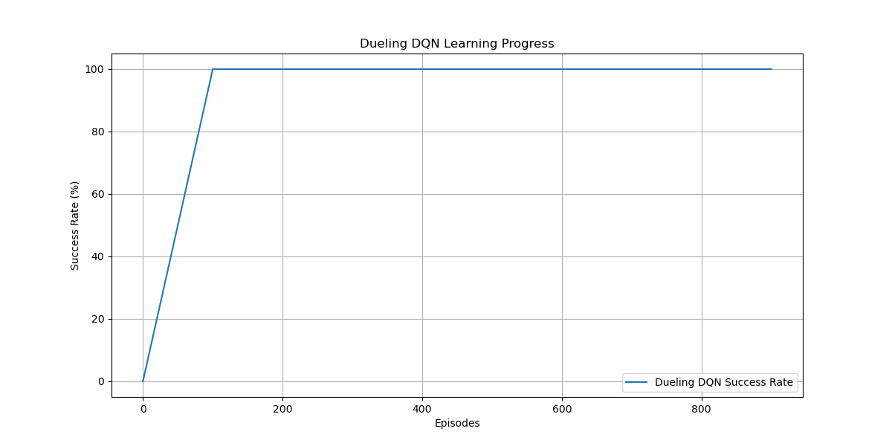
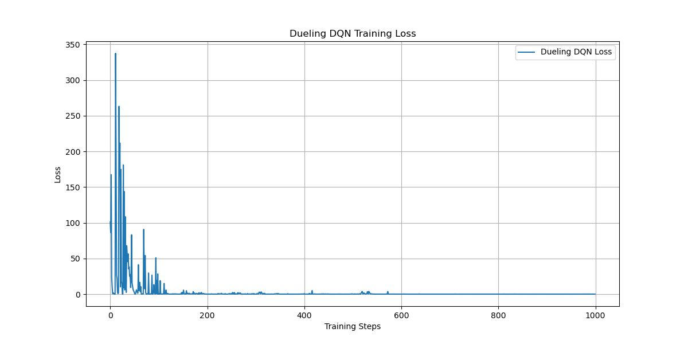
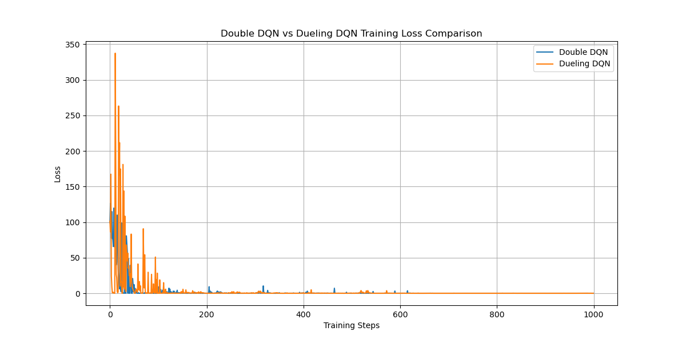

# HW4-2: Enhanced DQN Variants for Gridworld (player mode)

## 1. 作業題目與目標

本作業要求在 Gridworld 環境（player mode）下，實作並比較以下兩種強化學習演算法：
- **Double DQN**
- **Dueling DQN**

重點在於說明這兩種方法如何改進基本 DQN，並透過訓練與測試結果進行比較分析。

---

## 2. 方法原理與改進重點

### (1) Double DQN
- **基本 DQN 問題**：DQN 在計算目標 Q 值時，容易因為最大化操作而高估 Q 值（overestimation bias）。
- **Double DQN 改進**：
  - 將動作選擇與 Q 值評估分開，分別由主網路（online network）與目標網路（target network）負責。
  - 目標 Q 值計算方式：
    \[
    Q_{target} = r + \gamma Q_{target\_net}(s', \arg\max_a Q_{online\_net}(s', a))
    \]
  - 有效降低 Q 值高估現象，提升學習穩定性。

### (2) Dueling DQN
- **基本 DQN 問題**：在某些狀態下，動作選擇對結果影響不大，DQN 難以有效區分。
- **Dueling DQN 改進**：
  - 將 Q 值拆分為「狀態價值（Value）」與「優勢（Advantage）」兩個分支：
    \[
    Q(s, a) = V(s) + (A(s, a) - \frac{1}{|A|}\sum_{a'}A(s, a'))
    \]
  - 有助於網路更快學會哪些狀態本身就好，哪些動作才有差異。
  - 提升收斂速度與泛化能力。

---

## 3. 主要程式設計與訓練流程

- 以 PyTorch 實作 Double DQN 與 Dueling DQN 網路架構。
- 訓練時皆採用 ε-greedy 策略、MSE loss、Adam 優化器。
- 每 100 回合測試一次成功率，並記錄訓練損失。
- 訓練結束後，繪製損失曲線、成功率曲線，以及兩模型 loss 比較圖。
- 最終測試 100 回合，計算最終成功率。

---

## 4. 實驗結果與分析

### (1) Double DQN 學習曲線


> **圖1：Double DQN 學習過程成功率**

- 可見成功率隨訓練回合穩定上升，約在第 500 回合後達到 100%。


> **圖2：Double DQN 訓練損失曲線**

- 損失值隨訓練進行快速下降，收斂良好。

---

### (2) Dueling DQN 學習曲線


> **圖3：Dueling DQN 學習過程成功率**

- Dueling DQN 收斂速度更快，約 150 回合後即達到 100% 成功率。


> **圖4：Dueling DQN 訓練損失曲線**

- 初期損失較高，但下降速度快，最終收斂效果佳。

---

### (3) Double DQN vs Dueling DQN 比較


> **圖5：Double DQN 與 Dueling DQN 訓練損失比較**

- Dueling DQN 在 early stage loss 較大，但收斂速度明顯快於 Double DQN。
- 兩者最終都能達到低損失與高成功率。

---

### (4) 最終測試結果

```
Double DQN Final Success Rate: 100.0%
Dueling DQN Final Success Rate: 100.0%
```

- 兩種方法在 player mode 下最終都能學到最優策略，成功率 100%。
- Dueling DQN 收斂更快，學習效率略優。

---

## 5. 結論與心得

- **Double DQN** 有效解決 Q 值高估問題，提升學習穩定性。
- **Dueling DQN** 進一步加速收斂，對於狀態價值與動作優勢的分離有助於泛化。
- 兩者在 Gridworld (player mode) 下最終表現皆佳，Dueling DQN 在收斂速度上更具優勢。
- 本次實作過程中，熟悉了強化學習演算法的改進思路與 PyTorch 實作技巧。

---

## 6. 參考文獻/資源
- [Deep Reinforcement Learning in Action (書籍)](https://www.manning.com/books/deep-reinforcement-learning-in-action)
- [Double DQN 論文](https://arxiv.org/abs/1509.06461)
- [Dueling DQN 論文](https://arxiv.org/abs/1511.06581)
- 課堂教材與助教討論
