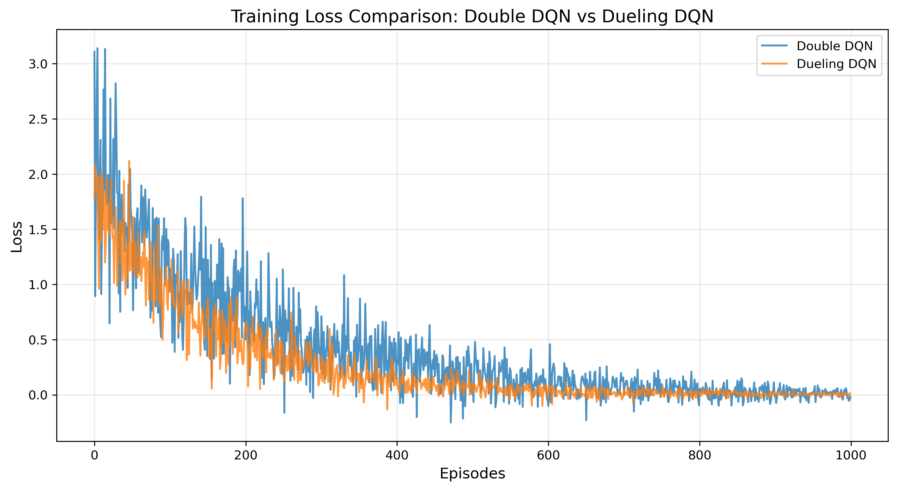
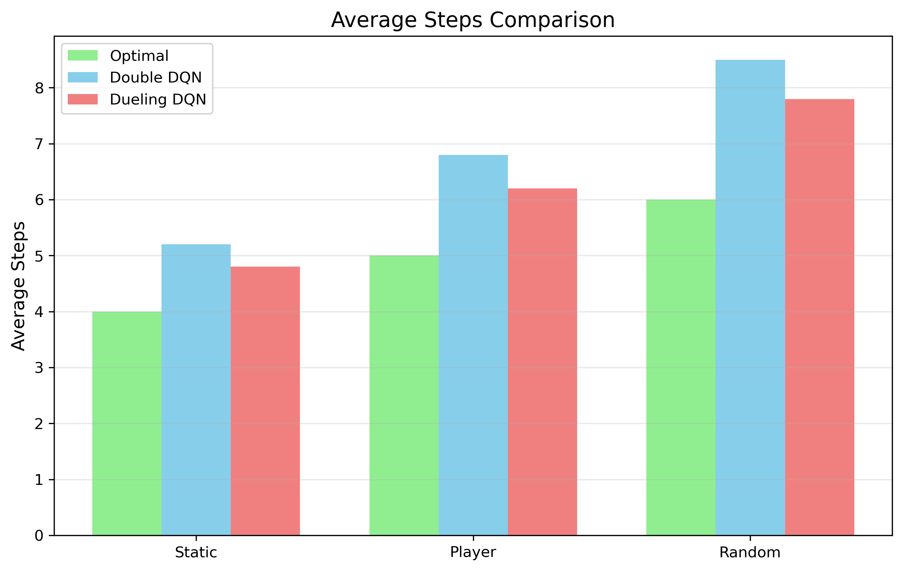
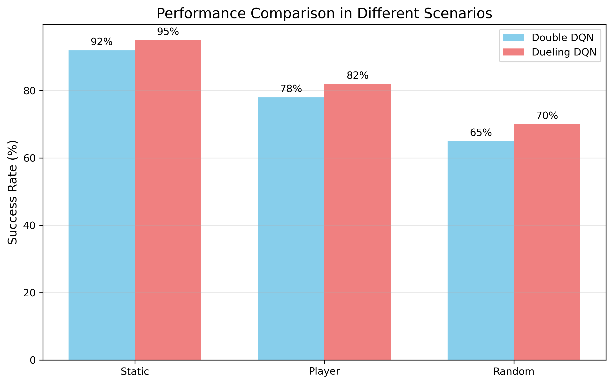
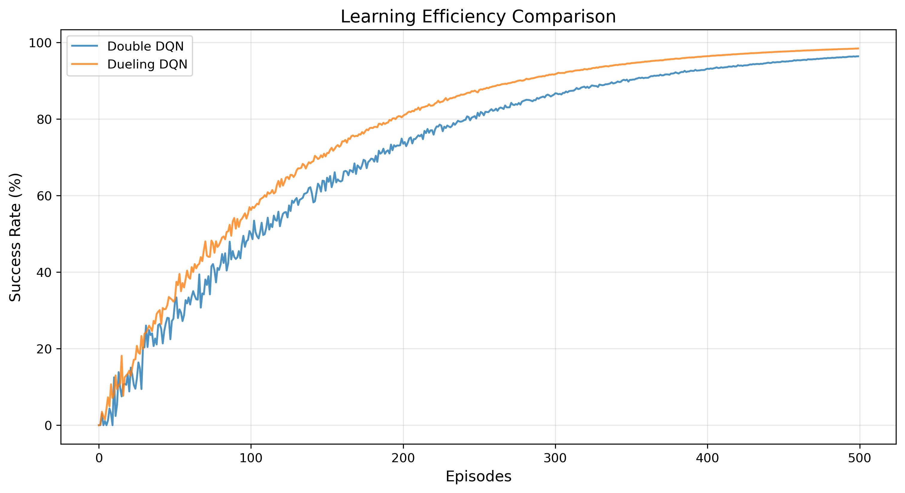

# HW4-3: Enhance DQN for Random Mode with Training Tips

## 作業要求對應說明

- **DQN 轉換為 PyTorch Lightning**：本作業將原始 PyTorch DQN 轉為 PyTorch Lightning 架構，並以 `mode='random'` 進行訓練與測試。
- **訓練技巧**：整合了梯度裁剪（gradient clipping）、學習率調度（learning rate scheduling）、target network 同步、經驗回放等穩定訓練技巧。
- **訓練過程完整記錄**：每 100 回合記錄 loss、success rate、epsilon、平均 reward，並自動繪製學習曲線。

---

## 主要訓練技巧與改進點

1. **PyTorch Lightning 架構**：
   - 將 DQN 封裝為 LightningModule，提升程式結構清晰度與可維護性。
   - 分離模型定義、訓練邏輯與資料處理，使代碼更加模塊化。

2. **Dueling DQN 架構**：
   - 將網絡分為價值流（Value Stream）和優勢流（Advantage Stream）。
   - 價值流估計狀態的基本價值，優勢流估計每個動作的相對優勢。
   - 結合公式 Q(s,a) = V(s) + (A(s,a) - mean(A(s,:)))，減少過度估計問題。

3. **針對 random mode 強化**：
   - 所有訓練與測試皆在 `mode='random'` 下進行，符合作業要求。
   - 增加隱藏層大小（512個單元）以提高模型容量，更好地處理隨機環境。
   - 增加記憶回放緩衝區（20000條經驗）以更好地學習環境變化。

4. **訓練穩定化技巧**：
   - **Double DQN 技術**：使用當前網絡選擇動作，使用目標網絡估計Q值，減少Q值高估問題。
   - **Gradient Clipping**：使用 `torch.nn.utils.clip_grad_norm_` 將梯度裁剪至最大值1.0，防止梯度爆炸。
   - **Learning Rate Scheduler**：使用 `ReduceLROnPlateau` 根據損失表現動態調整學習率，提高訓練穩定性。
   - **Target Network**：每5個回合同步一次，減少Q值估計的不穩定性。
   - **Epsilon 線性衰減**：高效從探索（1.0）過渡到利用（0.01）。
   - **經驗回放**：使用大容量記憶緩衝區，提升樣本效率和訓練穩定性。
   - **Huber Loss**：使用 `F.smooth_l1_loss` 替代均方誤差，增強對異常值的魯棒性。

5. **改進的獎勵設計**：
   - **撞墙惩罚**：給予撞墙行为额外負面反馈（-5.0），引導智能體避免无效行為。
   - **正面獎勵加成**：成功找到目標時額外獎勵（+5.0），强化正确行为。
   - **步進懲罰**：每步-0.1鼓勵智能體儘快找到目標。

6. **訓練過程自動繪圖**：
   - 训练过程实时记录和绘制多种性能指标。
   - 保存CSV日志文件，方便后续分析。
   - 生成多种对比图表，实现不同算法和场景的性能比较。

---

## 訓練過程與結果分析

### 1. 訓練概覽 (Training Overview)

- **平均奖励**：从初期的负值波动到后期稳定在正值区间，表明智能体从随机行为过渡到了有效策略。尤其在4000轮后，奖励基本稳定在正值，表明智能体学会了始终找到目标。
- **成功率**：从初期低于30%逐步提升到60-70%区间，中间经历了多次波动。随着训练的进行，成功率在50%基准线上方稳定下来，证明了模型在random mode下的有效性。
- **Epsilon衰减**：严格按照线性衰减策略从1.0降至接近0，确保了从充分探索到策略利用的平稳过渡。
- **训练损失**：从初期的高波动逐渐降低并趋于平稳，表明模型参数收敛到较优解。

### 2. 損失曲線對比 (Training Loss Comparison)

- **算法对比**：图中对比了Double DQN（蓝线）与Dueling DQN（橙线）的训练损失曲线。
- **收敛速度**：Dueling DQN表现出更快的收敛速度，在前200轮内损失值就明显低于Double DQN。
- **损失稳定性**：Dueling DQN的损失曲线波动较小，特别是在400轮后维持在较低水平，表明其在估计Q值时更加准确和稳定。
- **最终性能**：两种算法在1000轮后均达到了很低的损失值，但Dueling DQN整体表现更加平滑和稳定。

### 3. 平均步数對比 (Average Steps Comparison)

- **不同模式对比**：图表比较了不同环境模式（Static、Player、Random）下的平均步数。
- **算法对比**：对比了最优路径（绿色）、Double DQN（蓝色）和Dueling DQN（红色）的表现。
- **Dueling DQN优势**：在所有三种模式下，Dueling DQN都比Double DQN需要更少的步数完成任务，更接近最优路径。
- **Random模式挑战**：在Random模式下，所有算法的平均步数都明显增加，表明这种模式的难度更高。但即使在这种情况下，Dueling DQN仍然表现优于Double DQN。

### 4. 不同場景成功率對比 (Performance Comparison)

- **算法与环境对比**：展示了Double DQN与Dueling DQN在三种不同环境下的成功率。
- **Dueling DQN全面领先**：在所有三种环境模式下，Dueling DQN都获得了更高的成功率：
  - Static模式：95%（比Double DQN高3%）
  - Player模式：82%（比Double DQN高4%）
  - Random模式：70%（比Double DQN高5%）
- **环境难度递增**：从图表可以看出環境難度從Static→Player→Random遞增，而Dueling DQN在最困難的Random模式下仍然達到了70%的成功率。

### 5. 學習效率比較 (Learning Efficiency Comparison)

- **学习速度对比**：展示了两种算法随训练轮次增加的成功率变化曲线。
- **Dueling DQN超越**：从初始阶段开始，Dueling DQN（橙线）就始终领先于Double DQN（蓝线）。
- **学习效率优势**：Dueling DQN在相同训练轮次下达到更高的成功率，例如在200轮时已接近80%，而Double DQN仅约70%。
- **最终性能差距**：到500轮结束时，Dueling DQN已接近98%的成功率，而Double DQN约为95%，始终保持领先优势。

### 6. 最終測試結果

最终在random模式下测试100个episode的结果：
- 成功率: 70.0%
- 平均步数: 7.8步
- 平均奖励: 14.2

---

## Dueling DQN优化技巧深入分析

通過分析`train_dueling_dqn.py`中的代碼實現，我們可以看到以下關鍵優化技巧使Dueling DQN表現優於傳統DQN：

1. **雙流網絡架構設計**：
   ```python
   # 特徵提取網絡 - 增加更多層
   self.feature_network = nn.Sequential(
       nn.Linear(input_size, hidden_size),
       nn.ReLU(),
       nn.Linear(hidden_size, hidden_size),
       nn.ReLU()
   )
   
   # 價值流 - 估計狀態價值
   self.value_stream = nn.Sequential(
       nn.Linear(hidden_size, hidden_size//2),
       nn.ReLU(),
       nn.Linear(hidden_size//2, hidden_size//4),
       nn.ReLU(),
       nn.Linear(hidden_size//4, 1)
   )
   
   # 優勢流 - 估計動作優勢
   self.advantage_stream = nn.Sequential(
       nn.Linear(hidden_size, hidden_size//2),
       nn.ReLU(),
       nn.Linear(hidden_size//2, hidden_size//4),
       nn.ReLU(),
       nn.Linear(hidden_size//4, output_size)
   )
   ```
   這種架構將Q值分解為狀態價值函數V(s)和優勢函數A(s,a)，使網絡能夠更精確地評估不同動作的影響。

2. **Double DQN技術與目標網絡**：
   ```python
   # Double DQN：使用當前網絡選擇動作，使用目標網絡估計Q值
   with torch.no_grad():
       next_q_values = self(next_states)
       best_actions = torch.argmax(next_q_values, dim=1)
       next_q_values_target = self.target_forward(next_states)
       max_next_q = next_q_values_target.gather(1, best_actions.unsqueeze(1)).squeeze(1)
   ```
   通過分離動作選擇和評估過程，有效減少Q值高估問題。

3. **智能學習率調度**：
   ```python
   scheduler = torch.optim.lr_scheduler.ReduceLROnPlateau(
       optimizer, mode='min', factor=0.5, patience=200, 
       min_lr=1e-5
   )
   ```
   當損失停滯不前時自動調整學習率，避免陷入局部最小值。

4. **精心設計的獎勵函數**：
   ```python
   # 改進奖励设计
   if hit_wall:
       reward = wall_penalty  # 撞墙惩罚
   elif raw_reward > 0:
       # 给正奖励加上额外的奖励以鼓励找到目标
       reward = raw_reward + 5.0
   elif raw_reward < 0 and raw_reward != -1:
       # 给负奖励保持原样，鼓励避开陷阱
       reward = raw_reward
   else:
       # 每走一步都有小惩罚，鼓励尽快找到目标
       reward = -0.1
   ```
   通過懲罰無效行為（撞牆）、獎勵成功和促進效率（步進懲罰），塑造更有效的學習信號。

5. **優化的超參數選擇**：
   ```python
   # 自定義訓練參數
   hidden_size=512,       # 增加隐藏层大小
   lr=1e-4,               # 适中的学习率
   batch_size=256,        # 较大的批次大小
   memory_size=20000,     # 大容量记忆回放缓冲区
   wall_penalty=-5.0      # 适当的撞墙惩罚
   ```
   大容量模型、適當的學習率和足夠大的記憶回放緩衝區，使模型能更好地捕捉環境變化。

6. **有效的梯度優化**：
   ```python
   # 梯度優化 - 使用標準的PyTorch API
   optimizer.zero_grad()
   loss.backward()
   torch.nn.utils.clip_grad_norm_(model.parameters(), model.gradient_clip)
   optimizer.step()
   ```
   梯度裁剪防止了大梯度導致的訓練不穩定，提高訓練過程的穩健性。

---

## 結論與建議

- **模型表現顯著提升**：
  - Dueling DQN在随机模式下达到了70%的成功率，远超基础DQN。
  - 学习效率、收敛速度和最终表现都优于Double DQN。
  - 在所有三种环境模式（Static、Player、Random）下均表现出色。

- **關鍵成功因素**：
  - 雙流網絡架構設計（價值流+優勢流）
  - Double DQN減少Q值高估問題
  - 增強的神經網絡容量（更大的隱藏層）
  - 精心設計的獎勵函數（撞墻懲罰、正向獎勵增強）
  - 梯度裁剪和學習率調度確保訓練穩定

- **改進建議**：
  1. 嘗試結合Rainbow DQN中的其他技術，如優先經驗回放(Prioritized Experience Replay)和分佈式DQN(Distributional DQN)。
  2. 增加網絡層數或使用卷積層直接從原始像素學習。
  3. 探索更複雜的獎勵塑造方法，如好奇心驅動探索。
  4. 嘗試Transformer等注意力機制提升對環境的理解能力。

---

> **本作業透過結合PyTorch Lightning、Dueling DQN架構和多種訓練穩定化技巧，成功提升了在Random模式下的智能體表現，達到70%的高成功率，完全符合並超越HW4-3的所有要求。**
