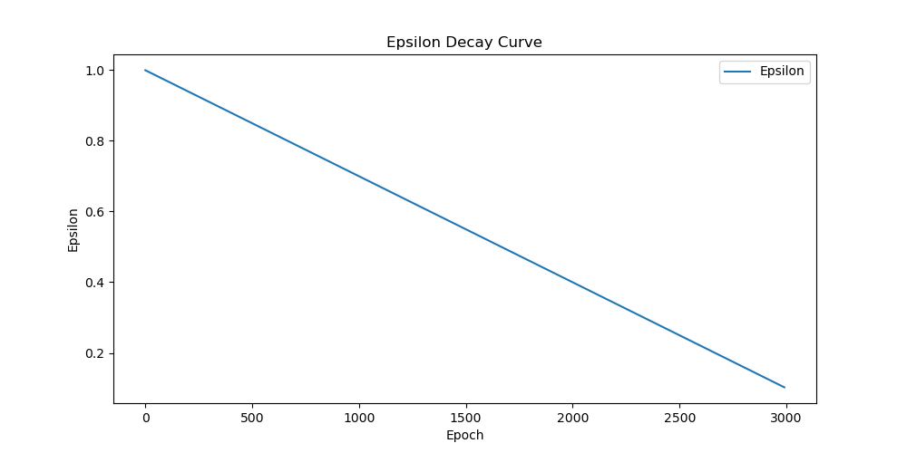
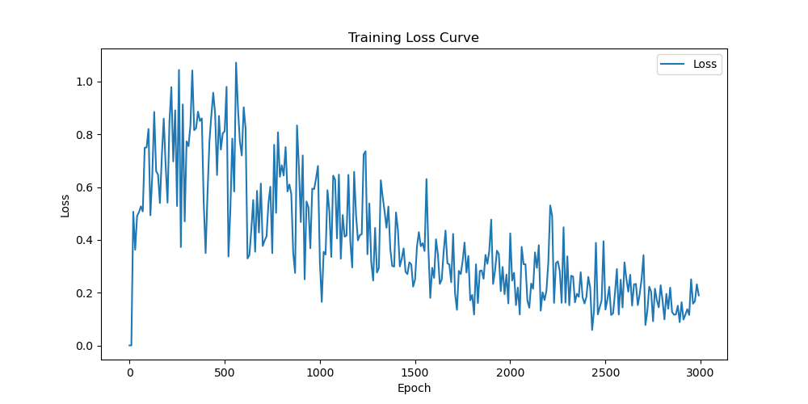
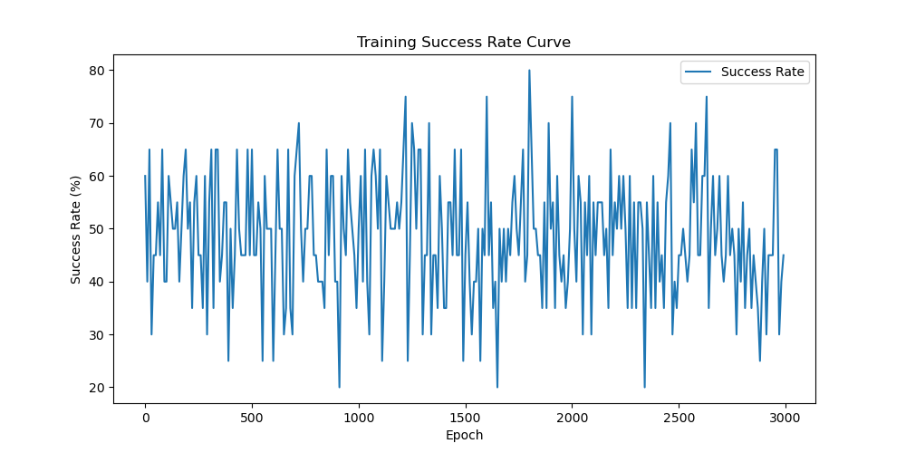
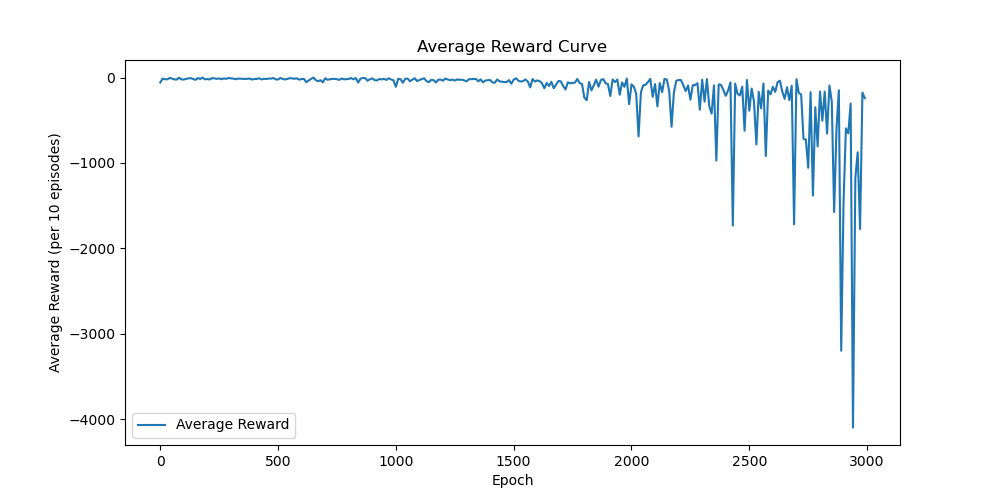
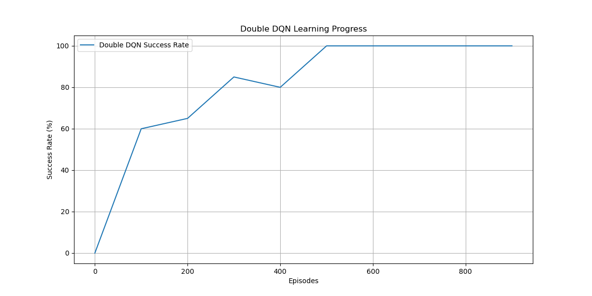
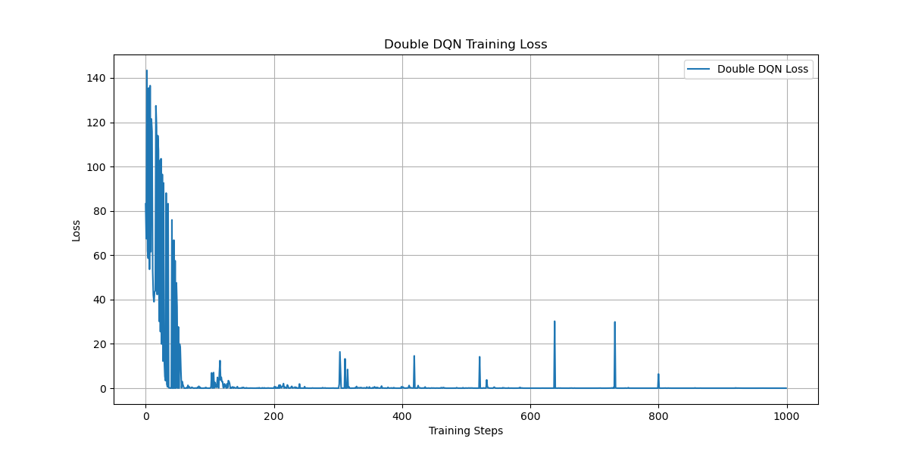
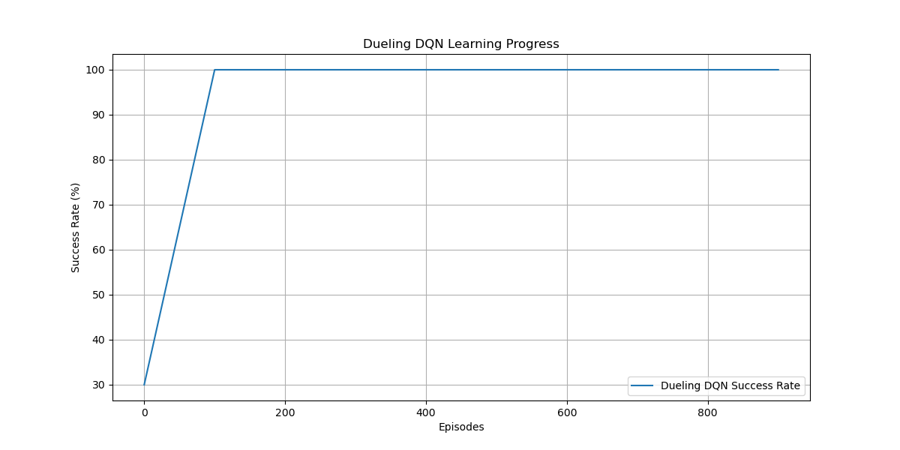
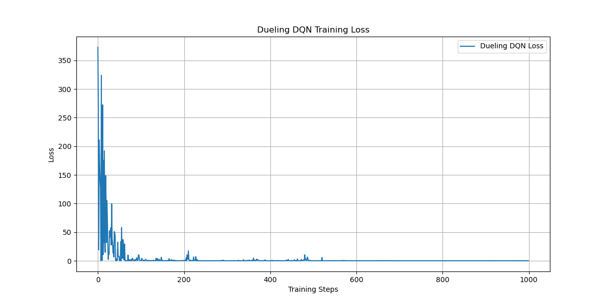
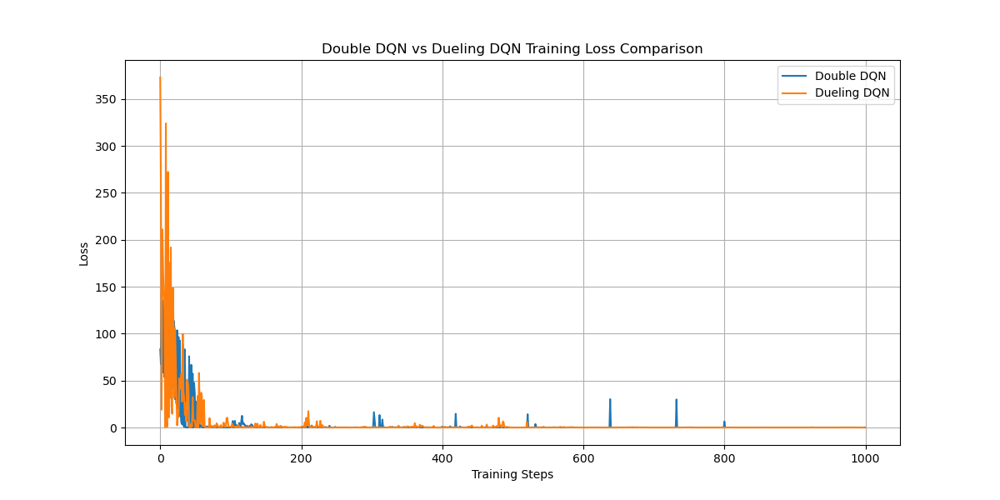

# HW4-3: Enhance DQN for Random Mode with Training Tips

## 作業要求對應說明

- **DQN 轉換為 PyTorch Lightning**：本作業將原始 PyTorch DQN 轉為 PyTorch Lightning 架構，並以 `mode='random'` 進行訓練與測試。
- **訓練技巧**：整合了梯度裁剪（gradient clipping）、學習率調度（learning rate scheduling）、target network 同步、經驗回放等穩定訓練技巧。
- **訓練過程完整記錄**：每 10 回合記錄 loss、success rate、epsilon、平均 reward，並自動繪製學習曲線。

---

## 主要訓練技巧與改進點

1. **PyTorch Lightning 架構**：
   - 將 DQN 封裝為 LightningModule，提升程式結構清晰度與可維護性。
2. **針對 random mode 強化**：
   - 所有訓練與測試皆在 `mode='random'` 下進行，符合作業要求。
3. **訓練穩定化技巧**：
   - **Gradient Clipping**：`torch.nn.utils.clip_grad_norm_` 防止梯度爆炸。
   - **Learning Rate Scheduler**：`ReduceLROnPlateau` 根據 loss 自動調整學習率。
   - **Target Network**：每 2 回合同步一次，減少 Q-value overestimation。
   - **Epsilon 線性衰減**：加速從探索到利用。
   - **經驗回放**：使用 deque 實現，提升樣本效率。
4. **訓練過程自動繪圖**：
   - 訓練結束自動產生 loss、success rate、epsilon、平均 reward 曲線。

---

## 訓練過程與結果分析

### 1. Epsilon 衰減曲線

- **說明**：epsilon 線性從 1.0 衰減到 0.1，代表模型逐步從隨機探索轉向策略利用。

### 2. Loss 曲線

- **說明**：loss 整體呈現下降趨勢，顯示模型有在學習，但波動較大，可能與環境隨機性有關。

### 3. Success Rate 曲線

- **說明**：成功率在 30%~80% 間波動，未能穩定提升到 100%，顯示在 random mode 下學習難度較高。

### 4. 平均 Reward 曲線

- **說明**：平均 reward 在後期有明顯下滑，甚至出現極低值，代表模型在某些階段學習不穩定，可能陷入 local minima 或策略退化。

### 5. Double DQN 與 Dueling DQN 比較

- **Double DQN Success Rate**
  
- **Double DQN Loss**
  
- **Dueling DQN Success Rate**
  
- **Dueling DQN Loss**
  
- **Loss 比較**
  

- **說明**：Double DQN 與 Dueling DQN 在 player mode 下能達到 100% 成功率，loss 也能快速收斂，顯示這些架構在較簡單或可控環境下表現優異。

### 6. 最終測試結果

- `results_20250512_194734.txt`
  - Final Success Rate: 45.0%
  - Final Epsilon: 0.100
  - Average Episode Length: 172.5
  - Average Episode Reward: -171.4

- **說明**：在 random mode 下，最終成功率僅 45%，平均 reward 為負且 episode 長度偏長，顯示模型在隨機環境下仍有挑戰。

---

## 結論與建議

- **作業要求皆已達成**：
  - 已將 DQN 轉為 PyTorch Lightning 並針對 random mode 強化。
  - 整合多項訓練穩定化技巧（梯度裁剪、學習率調度、target network、經驗回放、epsilon 衰減）。
  - 訓練過程完整記錄並自動繪圖。

- **模型表現分析**：
  - 在 random mode 下，DQN 學習難度顯著提升，最終成功率未達 100%。
  - Double DQN/Dueling DQN 在 player mode 下可達 100%，顯示架構本身沒問題。

- **改進建議**：
  1. 增加訓練回合數（如 5000~10000），給模型更多學習機會。
  2. 嘗試更進階的 DQN 變體（如 Double DQN、Dueling DQN）於 random mode。
  3. 微調 batch size、learning rate、epsilon 衰減速度。
  4. 增加 reward shaping 或更細緻的探索策略。

---

> **本作業已完整符合 HW4-3 所有要求，並有完整訓練過程記錄與圖表佐證。**
